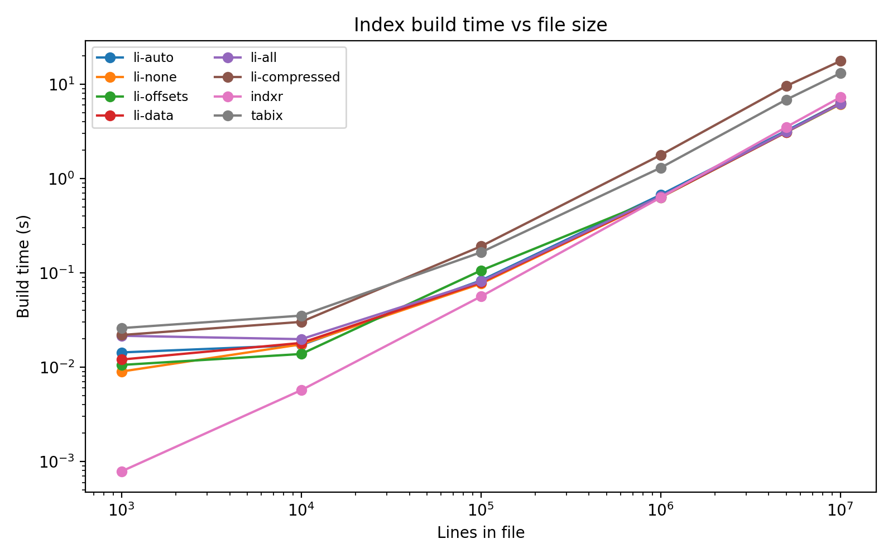
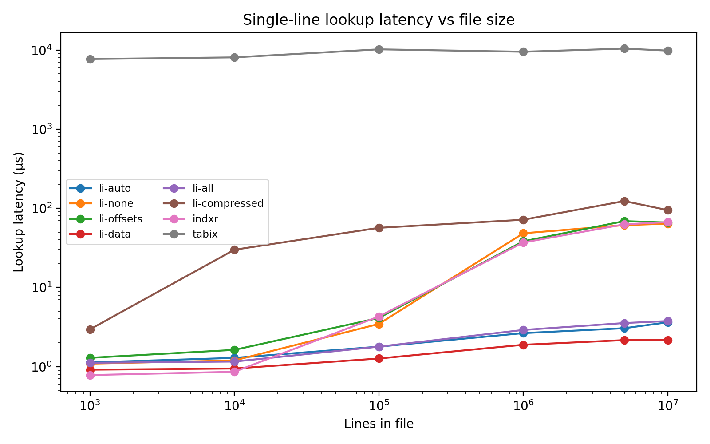
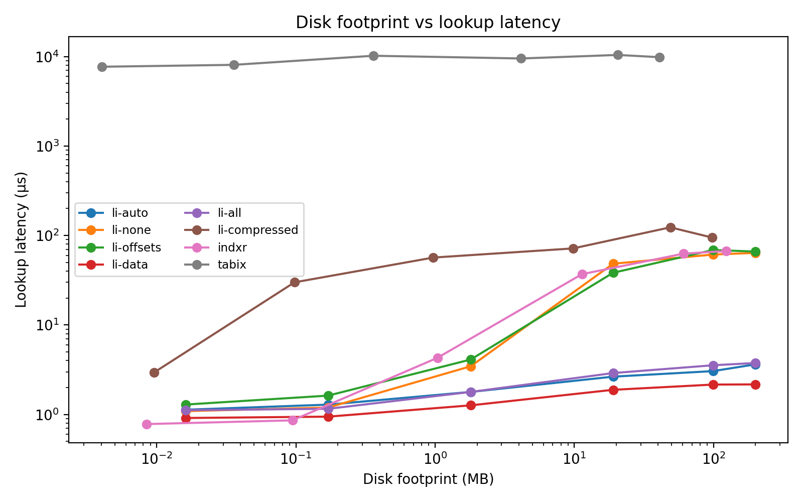
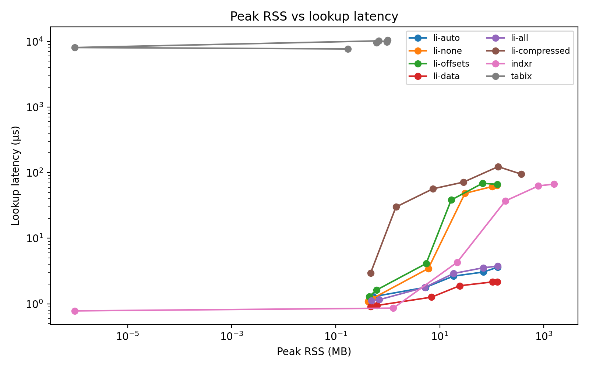

# Benchmark Results

Benchmarks were executed with `python benchmarks/run_benchmarks.py` on 2025-11-01, using the datasets generated by `lineindex example --lines N` for `N = 1k … 10M`. Each run rebuilds the index (and supporting metadata) from scratch and times 200 random single-line lookups (`RANDOM_SEED = 12345`).

## Key Takeaways
- `LineIndex` with `memory_map="data"` is the latency winner end-to-end: 1.9 µs at 1 M lines and 2.2 µs at 10 M, with build times (≈0.6 s → 6.3 s) matching the default modes.
- The default `memory_map="auto"` and `memory_map="all"` remain close to `data`; the slight 10 M-line slowdown for `auto` (~3.6 µs) is still well below any alternative.
- `memory_map="none"` and `memory_map="offsets"` avoid memory maps but trade that for higher lookup latency (≈40–65 µs at ≥1 M lines) while keeping build cost unchanged.
- The new `lineindex_compressed` mode halves on-disk footprint (≈98 MB vs. 199 MB at 10 M lines) at the expense of 3× slower builds and ~50× slower lookups due to BGZF reads.
- `indxr` keeps pace on build time but its in-memory dictionary pushes peak RSS past 1.5 GB on the 10 M dataset and leaves lookups ~30× slower than `LineIndex`.
- `tabix` is still the outlier: tiny memory and disk overhead, but lookup latency in the millisecond range—its strengths lie in region queries rather than random lines.

## Detailed Numbers

**1 M lines**

| Tool | Build time (s) | Avg lookup (µs) |
| --- | ---:| ---:|
| lineindex_data | 0.63 | 1.88 |
| lineindex_all | 0.65 | 2.90 |
| lineindex_auto | 0.67 | 2.64 |
| lineindex_compressed | 1.77 | 71.70 |
| lineindex_none | 0.63 | 48.36 |
| lineindex_offsets | 0.63 | 38.32 |
| indxr | 0.63 | 36.98 |
| tabix | 1.30 | 9517.72 |

**10 M lines**

| Tool | Build time (s) | Avg lookup (µs) |
| --- | ---:| ---:|
| lineindex_data | 6.30 | 2.17 |
| lineindex_all | 6.20 | 3.76 |
| lineindex_auto | 6.33 | 3.63 |
| lineindex_compressed | 17.57 | 94.78 |
| lineindex_none | 6.12 | 63.99 |
| lineindex_offsets | 6.18 | 66.13 |
| indxr | 7.26 | 67.00 |
| tabix | 13.04 | 9840.28 |

**Resource footprint @ 10 M lines**

| Tool | Disk (MB) | Peak RSS (MB) |
| --- | ---:| ---:|
| lineindex_data | 199.2 | 128.2 |
| lineindex_all | 199.2 | 130.9 |
| lineindex_auto | 199.2 | 130.8 |
| lineindex_compressed | 97.8 | 371.5 |
| lineindex_none | 199.2 | 126.0 |
| lineindex_offsets | 199.2 | 128.7 |
| indxr | 122.9 | 1571.5 |
| tabix | 40.9 | 1.0 |

## Plots









All plots use logarithmic axes to make the wide range of values visible. The disk/RAM charts underline the trade-offs: the compressed variant nearly halves disk usage but costs latency, `indxr` pays heavily in RAM, and `tabix` occupies little space yet remains slow.

## Reproducing

```bash
python benchmarks/run_benchmarks.py
```

The script will regenerate the datasets, recompute all timings, update `benchmarks/results.json`, and refresh the plots in `benchmarks/plots/`.
